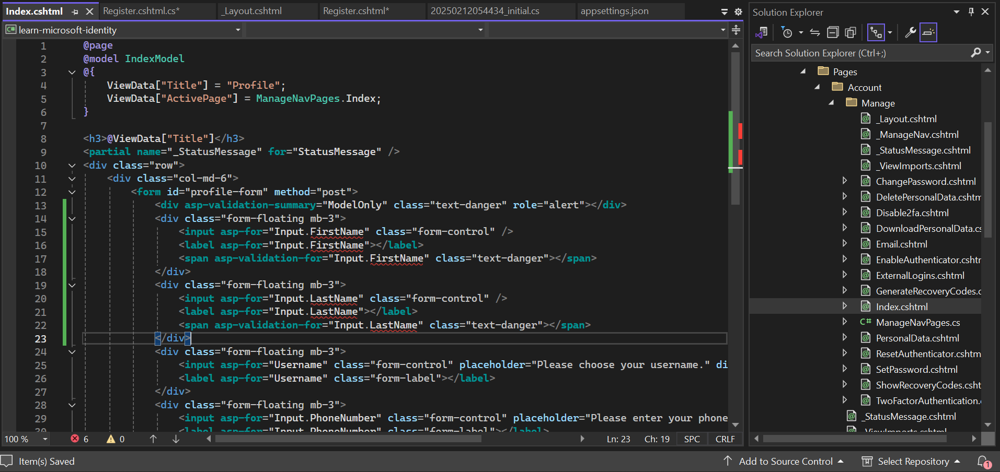
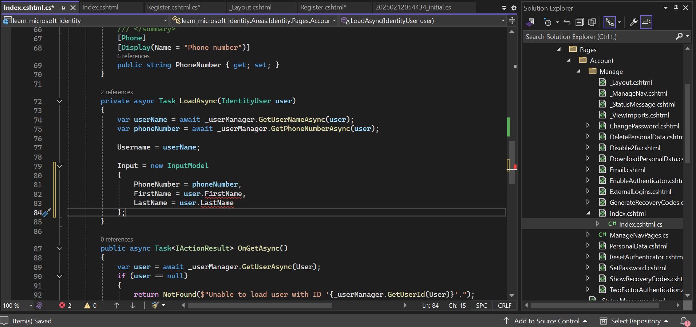

# Secure an ASP.NET MVC Web App Using Identity

## Overview

This module provides step-by-step guidance on securing an ASP.NET MVC web application using Identity. You will learn how to set up authentication, customize Identity to include additional user fields, and ensure secure user management.

## Prerequisites

- Visual Studio 2022 installed
- .NET 8.0 or later installed
- SQL Server installed

## 1. Create an ASP.NET MVC Project

1. Open **Visual Studio 2022**.
2. Click on **Create a new project**.

3. Select **ASP.NET Core Web App (Model-View-Controller)** and click **Next**.

4. Provide a project name and click **Create**.

5. Under **Authentication Type**, choose **None** and click **Create**.


## 2. Install Required NuGet Packages

1. Open **NuGet Package Manager** in Visual Studio.
2. Install the following packages:
   - `Microsoft.AspNetCore.Identity.EntityFrameworkCore`
   - `Microsoft.AspNetCore.Identity.UI`
   - `Microsoft.EntityFrameworkCore.SqlServer`
   - `Microsoft.EntityFrameworkCore.Tools`


## 3. Add Identity Scaffolding

1. Right-click on the **project** and select **Add** → **New Scaffolded Item**.

2. Select **Identity** and click **Add**.

3. Check the checkbox **Override all files**.

4. Click on the **+** icon next to **DbContext class** and add your DbContext.

5. Click **Add**.

6. A folder named **Areas** will be created in your project.


## 4. Customize Identity with Additional User Fields

1. Navigate to `Areas/Identity/Data`.
2. Create a new class named `ApplicationUser.cs`:

```csharp
using Microsoft.AspNetCore.Identity;
using System.ComponentModel.DataAnnotations;

public class ApplicationUser : IdentityUser
{
    [Required]
    [MaxLength(50)]
    public string FirstName { get; set; }

    [Required]
    [MaxLength(50)]
    public string LastName { get; set; }
}
```


3. Open your **DbContext** file and replace `IdentityUser` with `ApplicationUser`.

4. Modify `Program.cs` to use `ApplicationUser` in `AddDefaultIdentity`.


## 5. Configure Database Connection

1. Open `appsettings.json` and modify the `ConnectionStrings` section:

```json
"ConnectionStrings": {
  "ApplicationDbContext": "Server=YOUR_SERVER;Database=YourDatabase;Trusted_Connection=True;MultipleActiveResultSets=true;TrustServerCertificate=True"
}
```

## 6. Modify `Program.cs`

1. Add the following line before `var app = builder.Build();`:

```csharp
builder.Services.AddRazorPages();
```

2. Add the following line before `app.UseRouting();`:

```csharp
app.MapRazorPages();
```

3. Add the following line before `app.UseAuthorization();`

```csharp
app.UseAuthentication();
```


## 7. Apply Database Migrations

Run the following commands in **Package Manager Console**:

```powershell
add-migration "initial"
update-database
```

## 8. Add Sign-In and Registration Links

1. Open `Views/Shared/_Layout.cshtml`.
2. Add the following line inside the navigation bar:

```html
<partial name="_LoginPartial" />
```


## 9. Modify Registration Page to Include First and Last Name

1. Open `Areas/Identity/Pages/Account/Register.cshtml`.
2. Add the following fields:

```html
<div class="form-floating mb-3">
    <input asp-for="Input.FirstName" class="form-control" />
    <label asp-for="Input.FirstName"></label>
    <span asp-validation-for="Input.FirstName" class="text-danger"></span>
</div>
<div class="form-floating mb-3">
    <input asp-for="Input.LastName" class="form-control" />
    <label asp-for="Input.LastName"></label>
    <span asp-validation-for="Input.LastName" class="text-danger"></span>
</div>
```


3. Open `Register.cshtml.cs` and add these properties inside the `InputModel` class:

```csharp
[Required]
[StringLength(100, ErrorMessage = "The {0} must be at least {2} and at max {1} characters long.", MinimumLength = 1)]
[Display(Name = "First name")]
public string FirstName { get; set; }

[Required]
[StringLength(100, ErrorMessage = "The {0} must be at least {2} and at max {1} characters long.", MinimumLength = 1)]
[Display(Name = "Last name")]
public string LastName { get; set; }
```


4. Modify the `OnPostAsync` method to assign values to `FirstName` and `LastName`:

```csharp
var user = CreateUser();
user.FirstName = Input.FirstName;
user.LastName = Input.LastName;
```


## 10. Modify Profile Management Page

1. Open `Areas/Identity/Pages/Account/Manage/Index.cshtml`.
2. Add these fields:

```html
<div class="form-floating mb-3">
    <input asp-for="Input.FirstName" class="form-control" />
    <label asp-for="Input.FirstName"></label>
    <span asp-validation-for="Input.FirstName" class="text-danger"></span>
</div>
<div class="form-floating mb-3">
    <input asp-for="Input.LastName" class="form-control" />
    <label asp-for="Input.LastName"></label>
    <span asp-validation-for="Input.LastName" class="text-danger"></span>
</div>
```



3. Open `Index.cshtml.cs` and update the `InputModel` class:

```csharp
[Required]
[StringLength(100, ErrorMessage = "The {0} must be at least {2} and at max {1} characters long.", MinimumLength = 1)]
[Display(Name = "First name")]
public string FirstName { get; set; }

[Required]
[StringLength(100, ErrorMessage = "The {0} must be at least {2} and at max {1} characters long.", MinimumLength = 1)]
[Display(Name = "Last name")]
public string LastName { get; set; }
```


4. Modify the `LoadAsync` method:

```csharp
Input = new InputModel
{
    PhoneNumber = phoneNumber,
    FirstName = user.FirstName,
    LastName = user.LastName
};
```



5. Modify the `OnPostAsync` method:

```csharp
if (!ModelState.IsValid)
{
    await LoadAsync(user);
    return Page();
}
user.FirstName = Input.FirstName;
user.LastName = Input.LastName;
await _userManager.UpdateAsync(user);
```


## 11. Update Files to Use ApplicationUser Instead of IdentityUser

Now that you have created and customized the **ApplicationUser** class, you need to update your project files to use this new class instead of the default **IdentityUser** class. This involves changing references in the relevant pages and views like **Register, Login, Logout, Index, _LoginPartial.cshtml, etc**.


## 12. Apply Database Changes

Run the following commands in **Package Manager Console**:

```powershell
add-migration "CustomFields"
update-database
```

## 13. Run the Application

Press `Ctrl + F5` to start the application and test the authentication and user profile features.

## Conclusion

You have successfully secured your ASP.NET MVC web application using Identity. You also customized Identity by adding `FirstName` and `LastName` fields and integrated them into the registration and profile management pages. 🎉

